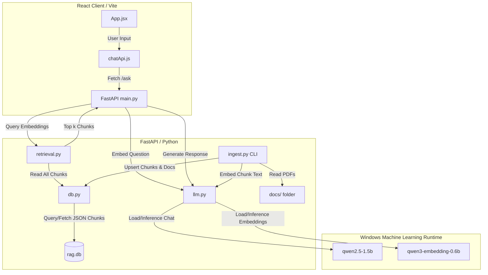

# Architecture Analysis: Local RAG Assistant

An architectural evaluation of the Local RAG Assistant codebase. This analysis documents the system topology, maps internal data flow and entry points, and highlights structural issues (technical debt) along with recommendations.

---

## 1. System Architecture Diagram

---

## 2. Key Entry Points

*   **Backend Server**: [backend/main.py](file:///C:/Users/USER/Desktop/rag-assistant/backend/main.py)
    *   Hosts the FastAPI application.
    *   Configures CORS middleware.
    *   Uses an `asynccontextmanager` lifespan function to run `init_db()` and `warm_up()` models on startup, and `shutdown()` on exit.
    *   Exposes endpoints `/ask` (POST) and `/health` (GET).
*   **Ingestion Pipeline**: [backend/ingest.py](file:///C:/Users/USER/Desktop/rag-assistant/backend/ingest.py)
    *   A command-line script running independent of the web server.
    *   Extracts pages from PDF files in `backend/data/docs`, chunks the text, embeds chunks, and upserts them to the SQLite database.
*   **Frontend UI Entry**: [frontend/src/main.jsx](file:///C:/Users/USER/Desktop/rag-assistant/frontend/src/main.jsx)
    *   Mounts the React tree inside the `#root` element.
*   **Frontend UI Controller**: [frontend/src/App.jsx](file:///C:/Users/USER/Desktop/rag-assistant/frontend/src/App.jsx)
    *   Coordinates chat state (`messages`, `draft`, `isSending`, `lastError`), renders the conversational layout, and calls `askAssistant()` on submission.

---

## 3. Structural and Architectural Issues (Technical Debt)

### 3.1. Scalability Bottleneck in Vector Retrieval
*   **Issue**: [retrieval.py](file:///C:/Users/USER/Desktop/rag-assistant/backend/retrieval.py) retrieves *every single chunk* from the database using `get_all_chunks()`, converts each chunk's JSON-serialized embedding into a NumPy array, and calculates cosine similarity in-memory using Python/NumPy for every query.
*   **Complexity**: $O(N)$ query time where $N$ is the total number of document chunks.
*   **Impact**: When the knowledge base scales to hundreds or thousands of pages, the query response time will degrade drastically, and memory consumption will spike.
*   **Recommendation**: 
    *   Migrate to a vector database index or lightweight library (e.g., `faiss-cpu`).
    *   Alternatively, utilize a SQLite extension like `sqlite-vec` or `sqlite-vss` to store vector types and perform k-NN searches directly in SQL.

### 3.2. Serialized JSON Format for Embedding Vectors
*   **Issue**: In [db.py](file:///C:/Users/USER/Desktop/rag-assistant/backend/db.py), embedding arrays are serialized as JSON strings (`json.dumps()`) and stored as SQLite `TEXT`.
*   **Impact**: High storage footprint and serialization/deserialization overhead.
*   **Recommendation**: Store vectors as binary `BLOB` fields (`float32` byte arrays). This allows fast reconstruction in Python using `np.frombuffer(row[x], dtype=np.float32)` and saves disk space.

### 3.3. Offline Ingestion Pipeline & Lack of File Upload API
*   **Issue**: Ingesting documents requires dropping PDF files in `backend/data/docs` and manually running `python ingest.py` in a separate command shell. There is no runtime file-upload mechanism in the FastAPI server.
*   **Impact**: Poor user accessibility. The user cannot interactively upload files from the UI.
*   **Recommendation**: 
    *   Expose an `/upload` endpoint in [main.py](file:///C:/Users/USER/Desktop/rag-assistant/backend/main.py) accepting multi-part form data (PDF files).
    *   Integrate the PDF extraction and embedding logic into FastAPI `BackgroundTasks` to process uploads asynchronously without blocking the server thread.

### 3.4. Database Connection Overhead
*   **Issue**: In [db.py](file:///C:/Users/USER/Desktop/rag-assistant/backend/db.py), functions like `get_document()`, `upsert_document()`, `insert_chunk()`, and `get_all_chunks()` each open, execute a query, commit, and close a new connection via `sqlite3.connect()`.
*   **Impact**: Repeated disk I/O overhead from establishing database connections. Potential lock contention if multiple write calls occur simultaneously.
*   **Recommendation**: Implement a connection pool or share a single long-lived database connection per request/context using FastAPI's dependency injection container (`Depends`), ensuring appropriate transaction control.

### 3.5. Naive Paragraph Chunking Strategy
*   **Issue**: [ingest.py](file:///C:/Users/USER/Desktop/rag-assistant/backend/ingest.py) uses `\n\n` to split text into paragraphs and aggregates them under character-length limits (`1200` characters maximum). 
*   **Impact**: It relies heavily on document format consistency. A document with long paragraphs, pages lacking `\n\n` markers, or tables can lead to oversized chunks, loss of context, or page-boundary truncations.
*   **Recommendation**: Replace the paragraph chunker with a recursive text splitter that splits by a hierarchy of characters (e.g., `\n\n`, `\n`, ` `, `""`) and implements a sliding window with chunk overlap (e.g., 100-200 characters) to ensure semantic continuity between adjacent chunks.

### 3.6. Coupled LLM/SDK Layer
*   **Issue**: [llm.py](file:///C:/Users/USER/Desktop/rag-assistant/backend/llm.py) imports `foundry_local_sdk` and manages global model state (`_loaded_models`).
*   **Impact**: Tests cannot be run in environments that lack the proprietary Windows Machine Learning binary dependency (`foundry-local-sdk-winml`).
*   **Recommendation**: Abstract the LLM interface with a client-agnostic wrapper (Strategy pattern). Provide a mock provider or an OpenAI-compatible API interface that allows running local server tests in isolated environments (like CI/CD pipelines).

### 3.7. Silent Error Fallback on Frontend
*   **Issue**: If a request in [chatApi.js](file:///C:/Users/USER/Desktop/rag-assistant/frontend/src/chatApi.js) fails or times out, it transparently returns a mock response (`buildMockAnswer`), and only prints a console warning.
*   **Impact**: The user may not notice that their backend server failed to load the model or is offline, leading to confusion when they receive generic mock text.
*   **Recommendation**: Bubble up connection issues to the main interface as error states or toast notifications, allowing the user to troubleshoot the backend state rather than masking the issue.
